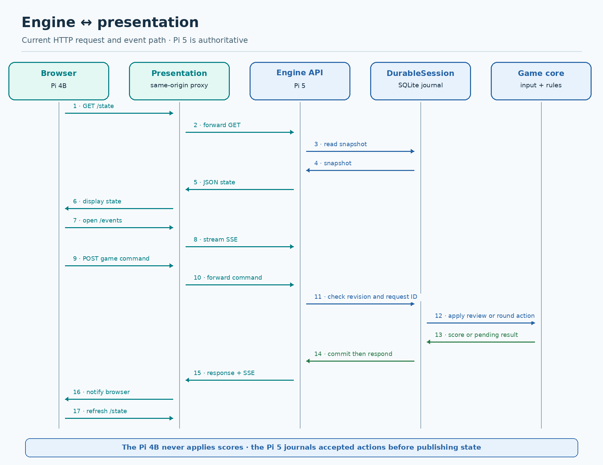
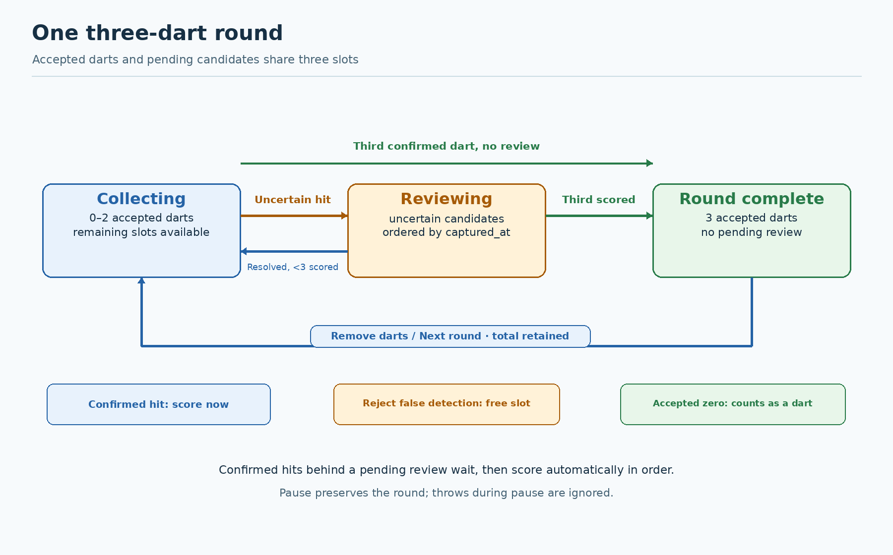
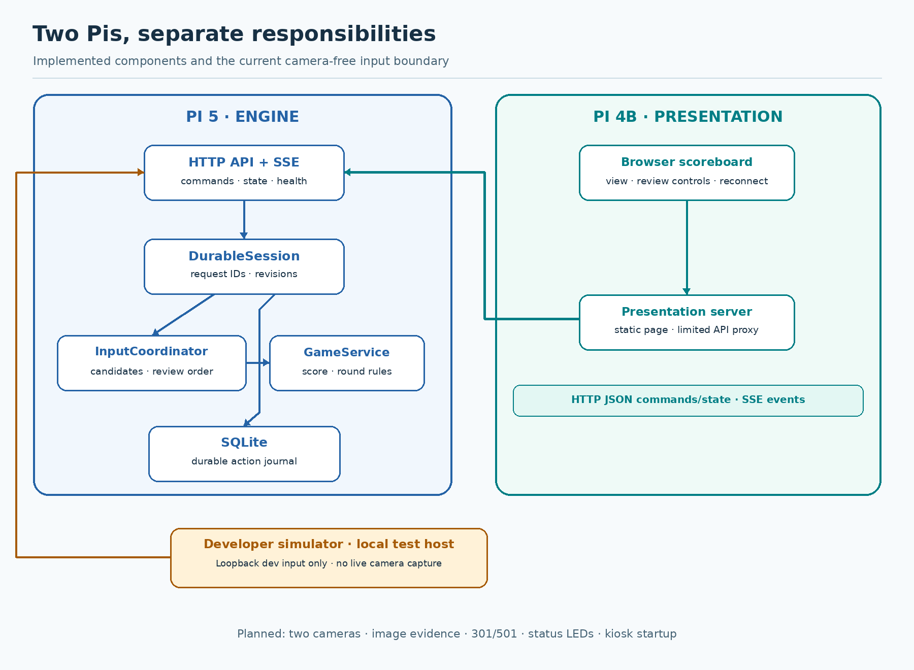

# Current two-Pi implementation

This page describes the code as it runs after the three-dart round work. The
Pi 5 owns scoring and the SQLite journal; the Pi 4B serves the browser and
proxies its API requests. Both processes can run as user systemd services.
The browser is opened separately on the Pi 4B screen; kiosk startup is not
implemented. Camera input and status LEDs are still planned.

## Engine and presentation interaction

The presentation proxy forwards only state, health, events, and game commands.
It does not expose `/api/v1/dev/actions`. The browser sends review decisions
and refreshes its view from engine state after commands and SSE events. On a
connection failure it marks the score stale, disables controls, and reconnects.

## One three-dart round

The total of scored and pending candidates cannot exceed three. Pending
candidates are reviewed by capture time, with arrival order for equal
timestamps. A confirmed dart behind an uncertain one waits, then scores
automatically when earlier reviews are resolved. A rejected false detection
does not use a dart; an accepted zero-point miss does. `next_round` clears the
three dart slots and preserves the cumulative total. Pausing preserves the
round; detections submitted during pause are ignored. The operator resumes
before resolving a pending dart or starting the next round.

## Ownership and separation of concerns

| Concern | Current owner |
| --- | --- |
| Game total, accepted throws, three-dart turn, and game phase | Pi 5 `GameService` |
| Candidate validation, uncertainty, review order, and camera-health state | Pi 5 `InputCoordinator` |
| Request IDs, revision checks, persistence, and restart recovery | Pi 5 `DurableSession` with SQLite |
| API state, commands, health, and event stream | Pi 5 HTTP server |
| Display, operator controls, reconnect behavior, and limited API proxy | Pi 4B presentation server and browser |
| Simulated hits for development | Loopback-only engine endpoint; no live camera producer yet |

The Pi 4B never calculates a score. The Pi 5 currently supports one player
and `simple_score`; two-camera detection, 301/501 rules, image evidence,
status LEDs, and browser kiosk startup remain separate implementation work.

The editable PNG source is `Docs/diagrams/render_current.py`. From the repo
root, run `python3 Docs/diagrams/render_current.py` to regenerate all three
images. It requires Pillow only for documentation work, not on the Pis.
