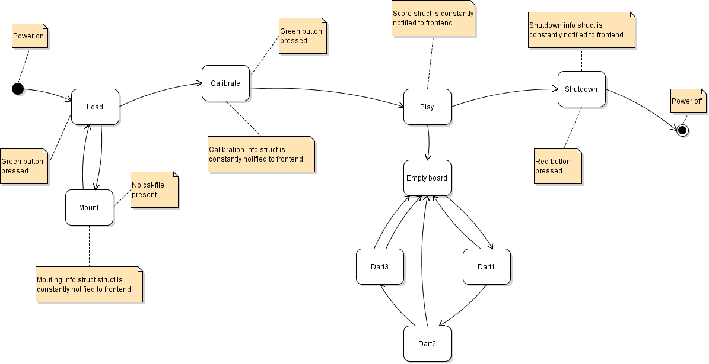

DartScore design concept and description
----------------------------------------

== Basics:
In this version the recognition is run on a raspberry pi 4
I have two cams built with raspberry pi 3 and the motioneyos running as fast networed cams

== Design:
DartScore is coded like a game-loop.
All items in the project (allmost) has at least 3 public methods: initialize, update, draw.
These are called for all objects in the project in a certain sequence.

== Root-directory:
*Main*:
The start for the project. Only used to start and run the loop and to catch general exceptions.

*MainLoop*:
The mainloop for the project. Implements methods for initialize, update and draw and decides
the order of the other items.

*DartScoreConfig.py*:
Not used in the first version! A dictionary with all kinds of settings to separate commonly used parameters from the code.
Each module will have its own sub config-dictionary.

Some testscripts, helpfiles and pictures...

== Modules/directories:
There are alot of modules and classes to separate things and get a design that is easy to modify.
The aim is that each class has a  `if __name__ == "__main__":` statement and should be possible to
'unit-test'

*Actuators*:
Classes for indication-leds

*BoardCalibration*:
Calibration and setup of board

*Inputs*:
Handles buttons and switches

*Logger*:
To log... Not used yet

*Recorder*:
Record the videostream

*StateLoops*:
Handles different states in the game, see below

*Utils*:
Some help methods used in several places

*Videos*:
Only a directory for storing recordings etc for test or documentation

*Vision*:
All things for the vision system detections etc

== The states:
A summary of the states in dartscore. The Load and shutdown states as the IO handling is not yet implemented.

