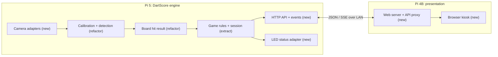

# Two-Pi architecture proposal

Status: proposal for review. This document describes the target boundaries, not implemented behavior.

## Hardware and ownership

- **Engine Pi:** Raspberry Pi 5 (8 GB), two cameras, 512 GB M.2 SSD, status LEDs.
- **Presentation Pi:** Raspberry Pi 4B (2 GB), display, local web service and fullscreen browser.
- Both Pis use PoE and a wired LAN. All player and operator interactions happen in the Pi 4B web UI. For the initial deployment, an independent GameService on the Pi 5 owns game rules and durable game state; this is a deployment choice, not a dependency of the rules on camera code. A presentation Pi restart must not interrupt a game.
- The Pi 4B serves the browser assets and proxies its own `/api/v1/*` requests to the Pi 5. The browser sees one origin. The proxy forwards explicit game commands; it does not implement game rules or calculate scores.
- The Pi 5 persists accepted game events and a recoverable current state on the SSD. A browser reconnect obtains a full snapshot before subscribing to updates.

Camera frames stay on the Pi 5. The API carries state, decisions and optional still images for setup, not two continuous video streams. The two cameras produce observations of one throw. The vision side resolves them into a **board hit** (for example, treble 20 = 60) or an uncertain candidate. The independent game service applies the selected game type (for example, 301/501, bust and turn rules) and alone changes a player's game total. A board hit is not itself an accepted game score.

## Ownership and migration map

| Area | Current source | Target | Treatment |
| --- | --- | --- | --- |
| Board geometry / score lookup | `BoardCalibration/BoardArray.py` | Engine Pi | Carry over initially; validate geometry and boundaries with labelled throws. |
| Calibration | `CamCalibrateLoop.py`, `Lines.py`, `Sectors.py` | Engine Pi | Refactor into one calibration record per camera, in common board coordinates. |
| Detection / tip estimate | `DartDetector.py`, `DartHit.py` | Engine Pi | Refactor into camera observations and one throw decision; preserve replay baseline. |
| Game types, turns and totals | `PlayStateLoop.py` | Independent GameService, initially Pi 5 | Extract from detection and rendering; rules for 301/501 can be added without changing camera code. |
| Capture | `Cam.py`, `StreamCam.py`, `VideoCam.py` | Engine Pi | New camera-source interface; retain file replay adapter. |
| Orchestration | `Main.py`, `MainLoop.py`, state loops | Engine Pi | Separate capture, game, API, persistence and hardware lifecycles. |
| Old Pygame presentation | `FrontEnd/*` and state-loop `draw()` | Retired after parity | Replace with web UI; keep as reference while migrating. |
| GPIO buttons / buzzer | `PiSetup/IO/*` | Engine Pi if needed | Isolate behind hardware interfaces; do not import GPIO in game logic. |
| HTTP API and persistence | New | Engine Pi | Versioned contract and durable accepted events. |
| Web UI and proxy | New | Presentation Pi | All game interactions and rendering; forward commands to GameService without implementing rules. |
| LED status | New | Engine Pi | Status consumer, never a source of game decisions. |

## Internal boundaries

`CameraSource` emits `Frame(camera_id, captured_at, sequence, pixels)`.
`CalibrationService` maps each camera's image coordinates to a common board coordinate system.
`Detector` emits candidate observations with camera ID and evidence.
`ThrowResolver` groups observations by time and board position, yielding one board hit candidate or an uncertain result. Its output includes `throw_id`, board segment/multiplier, numeric board points, confidence/evidence reference, and never a player's remaining total.
`GameService` selects a game type, validates commands, handles player order, bust/finish rules, and alone commits a throw to the game. `EventStore` persists accepted game events.
`ApiService` publishes snapshots/events and validates commands. `LedStatus` maps health and engine state to GPIO outputs.

The GameService communicates through typed observations and commands, without importing camera, OpenCV, Pygame, HTTP, or GPIO code. It can be moved to another process or host later without rewriting 301/501 rules. Pi 5 is the proposed first host because its SSD can retain the game when the display Pi reboots; Pi 4B remains the sole interaction surface. These are proposed responsibilities, not mandatory class names. The first migration can keep one camera and use the recorded-video replay input. Introduce the second camera only after the game and API boundaries work.

## LED proposal

| LED state | Meaning |
| --- | --- |
| Blue | Starting or calibrating |
| Green | Ready for play |
| Amber | Operator attention: uncertain throw or calibration needed |
| Red | Engine or camera unavailable |

A disconnected presentation Pi is reported in health/status but does not invalidate scoring. LED outputs default to an unambiguous error/off state on engine shutdown; exact pins and driver are hardware configuration.

## Delivery sequence

1. Agree on the architecture and API contract. Add contract examples and tests before network code.
2. Extract a pure GameService and typed board-hit observations from `PlayStateLoop`; replay one camera into it. Add one basic game type, then 301/501 rules as separate strategies.
3. Add persistence, snapshot, event stream and command API on the engine Pi.
4. Add the Pi 4B proxy and browser scoreboard; verify restart and reconnect during a game.
5. Add LED adapter, then two-camera capture, independent calibration and throw resolution.
6. Replace the old Pygame entry point after the web UI covers mounting, calibration and play.

The initial web UI targets scoreboard and status. Setup still images can follow. Measure the Pi 4B kiosk memory and responsiveness before adding continuous previews.
