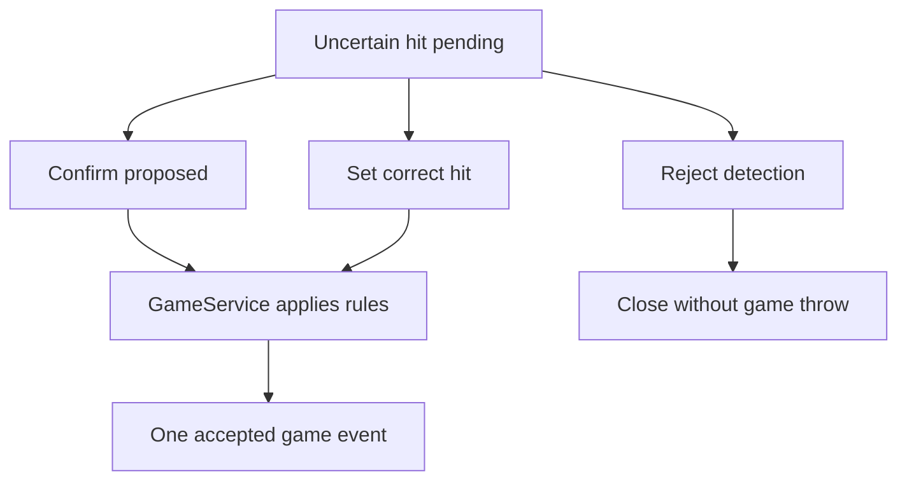

# Web UI: first release design

Status: design proposal. This document does not implement the browser or change game rules.
See [two-Pi architecture](two-pi-architecture.md) and [API contract](engine-presentation-api-v1.md).

## Scope and deployment

The Raspberry Pi 4B (2 GB) runs a lightweight web server/proxy and a fullscreen browser on the attached screen. The Pi 5 remains authoritative for board hits, game rules and durable game state. The Pi 4B never calculates a score. It loads a snapshot after opening/reconnecting and applies engine events in revision order. The web UI must clearly show when the engine connection is lost and disable commands until a fresh state is loaded.

The first playable integration should support the existing simple accumulating-score mode and one player. The layout is designed for multiple players and 301/501, but those choices are shown only when the corresponding GameService rules exist. A disabled future game type must never appear to start a playable game.

## Main screen

A readable scoreboard is the primary view at typical TV/monitor distance. It uses responsive layout rather than the old fixed 1680 × 1050 Pygame coordinates.

| Region | Contents | Interaction |
| --- | --- | --- |
| Header | Game type, phase, current player, engine connection and camera status | Open status details |
| Scoreboard | Large current total or remaining score, current turn's hits, player names | Read-only |
| Latest throw | Board hit (for example T20 / 60), applied game result and time | Open throw details |
| Controls | Start game when idle; pause/resume while playing | Explicit buttons |
| Attention panel | Pending uncertain throw, reason and still images if available | Confirm, set correct hit, or reject |

Visual priority: score first, pending attention second, status third. Use large text, clear contrast and named states in addition to color. Keep controls usable by mouse or touch; keyboard shortcuts are optional. Do not cover an uncertain hit with a transient notification.

## Game setup

Start Game opens a small setup panel with game type, player name(s) and relevant rule options. V1 can offer only the implemented simple-score game and one player. The UI sends one `start_game` command with a unique request ID. It displays the returned engine state, not a locally predicted score. A running game must not be replaced without an explicit end/reset flow; that flow is out of first scope.

Pause stops accepting new scored throws according to GameService policy; the engine may continue camera health monitoring. Resume restores play. The UI shows a persistent Paused state. Whether a throw that lands during pause is ignored or queued must be defined before implementing those commands; the proposal is **ignored with diagnostic evidence**, never silently counted on resume.

## Uncertain-hit review

An uncertain throw creates a pending item with a unique `throw_id`. The player's game total does not change. The attention panel remains visible until resolved and shows the proposed board hit, reason and optional still-image references from both cameras.

The operator has three mutually exclusive actions:

1. **Confirm proposed hit:** accept the proposed physical board hit; GameService applies the active game rules.
2. **Set correct hit:** select single/double/triple and segment 1–20, outer bull (25), inner bull (50), or miss (0). The UI calculates points only for immediate preview; the Pi 5 validates and computes the authoritative result. A points-only fallback can be offered when the exact segment/ring is unknown; mark that correction as `points_only`, unsuitable as a location label for future learning.
3. **Reject detection:** it was not a dart/throw. No game throw or score is committed. This differs from an accepted miss worth zero points.

A manual correction replaces the pending candidate atomically; it does not create a second throw. The UI sends `throw_id`, a unique request ID and expected game revision. Disable repeat submission while waiting; retries with the same request ID return the same result. On a revision conflict or lost connection, reload the snapshot before offering another action. Show an explicit success or failure and never assume a click has committed a score.

## Evidence for later learning

On the Pi 5, retain an evidence record keyed by `throw_id`: camera IDs, capture timestamps, calibration version per camera, candidate board locations/confidence, and references to the relevant still frames/crops. Accepted automatic results, manual corrections and rejected detections are stored as separate outcome labels linked to that evidence. Store operator-supplied segment/ring separately from calculated points and game-rule effects (bust, remaining total). A points-only correction must not masquerade as a precisely located hit.

This release only records data and makes evidence available for reviewing one pending hit. Dataset export, model training, automated learning and long-term image retention policy are later work. Set a bounded local image retention policy before enabling continuous evidence capture; keep game records independently of image cleanup.

## UI states and acceptance checks

| State | Visible behavior |
| --- | --- |
| Loading/reconnecting | Show last known score as stale, with connection indicator; disable commands until snapshot succeeds |
| Idle | Show Start Game and health |
| Playing | Scoreboard and Pause; latest accepted throw |
| Paused | Persistent paused banner and Resume |
| Attention | Pending throw panel; total unchanged; resolve with one of three actions |
| Engine error | Clear reason, camera status and recovery guidance; no speculative score changes |

- Pi 4B reboot/browser reload restores the current game, including any pending uncertain throw.
- A duplicated event or repeated command never counts a throw twice.
- Manual hit selection is validated by the Pi 5 and produces one accepted throw, with the active game type determining the resulting total.
- Reject and accepted miss remain distinct in both UI and stored records.
- A pending hit has a visible path to confirmation, correction or rejection; losing the connection cannot silently dismiss it.
- The Pi 4B remains usable as a scoreboard without continuous camera previews.
