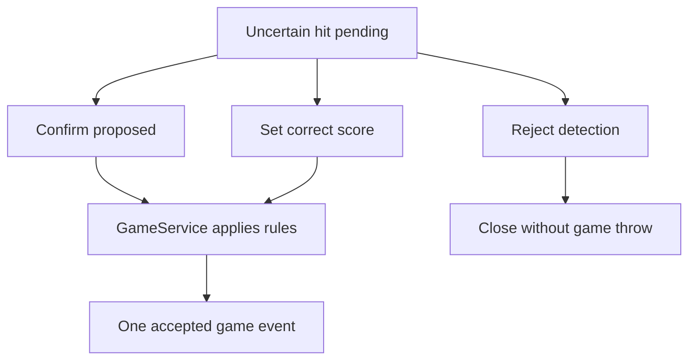

# Web UI: first release design

Status: first camera-free browser/proxy slice implemented. This document also describes planned later additions, including evidence image viewing and richer player/game setup.
See [two-Pi architecture](two-pi-architecture.md) and [API contract](engine-presentation-api-v1.md).

## Scope and deployment

The current Pi 4B process is `python3 SW/serve_presentation.py --engine-url http://<pi5-address>:8765 --host 0.0.0.0`. It serves the browser on port 8080 and proxies only state, health, events and commands under `/api/v1`. The Pi 5 engine must bind to a reachable trusted-LAN address with `SW/serve_engine.py --host <pi5-address>`. The proxy does not expose the Pi 5 development input route. Network access controls, service units and kiosk startup are separate deployment work; use only on a trusted LAN for now.

On one development computer, run the engine with `python3 SW/serve_engine.py --db runtime/game.sqlite3 --dev-input` and the presentation with `python3 SW/serve_presentation.py`, then open `http://127.0.0.1:8080`. The engine's loopback-only development endpoint can supply simulated hits. The browser shows their state through the proxy. The page refreshes `/state` after SSE messages and reconnects, and disables controls when the engine becomes unreachable.

The Raspberry Pi 4B (2 GB) runs a lightweight web server/proxy and a fullscreen browser on the attached screen. The Pi 5 remains authoritative for board hits, game rules and durable game state. The Pi 4B never calculates a score. It loads a snapshot after opening/reconnecting and applies engine events in revision order. The web UI must clearly show when the engine connection is lost and disable commands until a fresh state is loaded.

The first playable integration should support the existing simple accumulating-score mode and one player. The layout is designed for multiple players and 301/501, but those choices are shown only when the corresponding GameService rules exist. A disabled future game type must never appear to start a playable game.

The current slice displays the total, current turn, phase, camera states and pending points-only candidate. It has Start, Pause/Resume and Confirm/Correct/Reject controls. The API does not yet expose a latest-throw summary, player-name configuration or evidence images; the page shows evidence references as text. It does not calculate game rules locally.

## Main screen

A readable scoreboard is the primary view at typical TV/monitor distance. It uses responsive layout rather than the old fixed 1680 × 1050 Pygame coordinates.

| Region | Contents | Interaction |
| --- | --- | --- |
| Header | Game type, phase, current player, engine connection and camera status | Open status details |
| Scoreboard | Large current total or remaining score, current turn's hits, player names | Read-only |
| Latest throw | Board hit (for example T20 / 60), applied game result and time | Open throw details |
| Controls | Start game when idle; pause/resume while playing | Explicit buttons |
| Attention panel | Pending uncertain throw, reason and still images if available | Confirm, set correct score, or reject |

Visual priority: score first, pending attention second, status third. Use large text, clear contrast and named states in addition to color. Keep controls usable by mouse or touch; keyboard shortcuts are optional. Do not cover an uncertain hit with a transient notification.

## Game setup

Start Game opens a small setup panel with game type, player name(s) and relevant rule options. V1 can offer only the implemented simple-score game and one player. The UI sends one `start_game` command with a unique request ID. It displays the returned engine state, not a locally predicted score. A running game must not be replaced without an explicit end/reset flow; that flow is out of first scope.

While paused, camera monitoring may continue for health, but throw detection is not submitted to GameService. Throws during pause are ignored: they create no pending item, score, turn change, or other game-state mutation, and are not queued for resume. Resume restores play from the same game state. The UI shows a persistent Paused state. The capture pipeline must establish a fresh comparison baseline on resume so a dart that arrived during pause is not scored afterward.

## Uncertain-hit review

An uncertain throw creates a pending item with a unique `throw_id`. The player's game total does not change. The attention panel remains visible until resolved and shows the proposed board hit, reason and optional still-image references from both cameras.

The operator has three mutually exclusive actions:

1. **Confirm proposed hit:** accept the proposed physical board hit; GameService applies the active game rules.
2. **Set correct score:** enter one dart's numeric board score. The Pi 5 validates it against achievable single-dart scores (0, singles 1–20, doubles 2–40, triples 3–60, 25 and 50), then applies the active game rules. Store the correction with `label_quality: "points_only"`; a numeric score may correspond to several sectors/rings and is not a precise location label. A later step can add selection of the correct sector and ring on a dartboard image.
3. **Reject detection:** it was not a dart/throw. No game throw or score is committed. This differs from an accepted miss worth zero points.

A manual correction replaces the pending candidate atomically; it does not create a second throw. The UI sends `throw_id`, a unique request ID and expected game revision. Disable repeat submission while waiting; retries with the same request ID return the same result. On a revision conflict or lost connection, reload the snapshot before offering another action. Show an explicit success or failure and never assume a click has committed a score.

## Evidence for later learning

On the Pi 5, retain an evidence record keyed by `throw_id`: camera IDs, capture timestamps, calibration version per camera, candidate board locations/confidence, and references to the relevant still frames/crops. Accepted automatic results, manual corrections and rejected detections are stored as separate outcome labels linked to that evidence. The initial operator label is numeric points only; store it separately from the engine's candidate segment/ring and the game-rule effect (bust, remaining total). A points-only correction must not masquerade as a precisely located hit. Later sector selection on a dartboard image can add a richer location label without changing historical points-only records.

This release only records data and makes evidence available for reviewing one pending hit. Saved evidence images remain on the Pi 5 until manually deleted by the operator; there is no automatic age-based or free-space cleanup in step 1. Game records remain independently readable if their images are manually removed. The Pi 5 reports remaining disk space and an image-write failure visibly; a full disk must not silently corrupt game state. Step 2 can delete the oldest evidence images to maintain a defined free-space reserve. Dataset export, model training and automated learning are later work.

## UI states and acceptance checks

| State | Visible behavior |
| --- | --- |
| Loading/reconnecting | Show last known score as stale, with connection indicator; disable commands until snapshot succeeds |
| Idle | Show Start Game and health |
| Playing | Scoreboard and Pause; latest accepted throw |
| Paused | Persistent paused banner and Resume |
| Attention | Pending throw panel; total unchanged; resolve with one of three actions |
| Engine error | Clear reason, camera status and recovery guidance; no speculative score changes |

- Pi 4B reboot/browser reload restores the current game, including any pending uncertain throw.
- A duplicated event or repeated command never counts a throw twice.
- A manually entered single-dart score is validated by the Pi 5 and produces one accepted throw, with the active game type determining the resulting total.
- Reject and accepted miss remain distinct in both UI and stored records.
- A pending hit has a visible path to confirmation, correction or rejection; losing the connection cannot silently dismiss it.
- Throws during pause never change game state and cannot appear as scored throws after resume.
- Evidence images remain until manual deletion in step 1; disk capacity and write failures are visible.
- The Pi 4B remains usable as a scoreboard without continuous camera previews.
