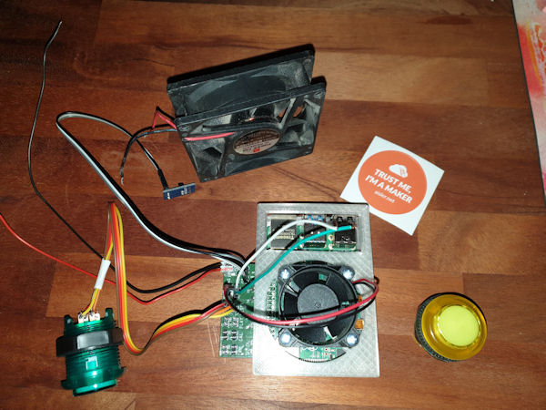

= Dartscore hardware

board, cams, brackets, lightning, moutning details etc etc...

The board:
----------
I use a lightbox for the board to get even lighting conditions.

image:../Docs/dartboardlightbox.jpg[the lightingbox]

The Cams:
---------
I use a raspberry pi 3 with a raspicam and the motioneye os in fast networked cam setup for
both cams.

image:Netcam_front.jpg[One of the netcams]

One of the cameras

image:../Docs/bracket-bottom.jpg[Camera bracket]

The 3d printed camera bracket

The PCB:
--------
In the 'eagle' directory is  a circuit board designed to use with a raspberry pi 4 as the
main cumputing device in the DartScore project.

The first version of the pcb is like an array of relays, designed with connectors for switches and leds and also for
the control of 2 fans,
one for the CPU and one for the 'box'.  In my project I use 'arcade-switches' and they neeed 5V as supply for the built
in leds. Therefore all outputs are 'switched' with mosfets (the 'relays'). The same goes for the fans which are 12V
supplied (I use standard PC fans).

The PCB is available from here: https://aisler.net/p/PMFAHSJW

In the future the PCB will probably be more sofisticated, like one 12V inpout that drives everything including the
Pi itself.

image:DartScorePcb_v1.jpg[The pcb]

Physical installation:
----------------------

Note that the PCB is mounted with the connectors on the ouside of the Pi-enclosure.
