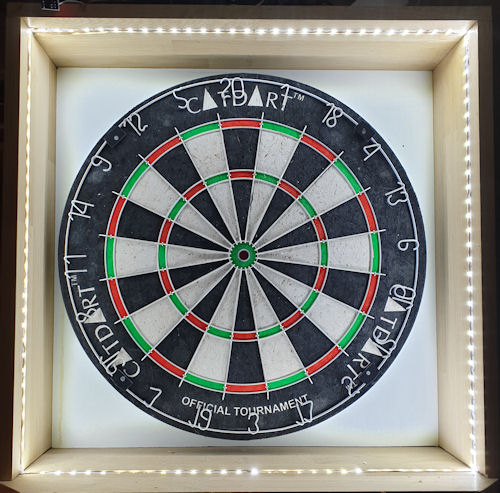
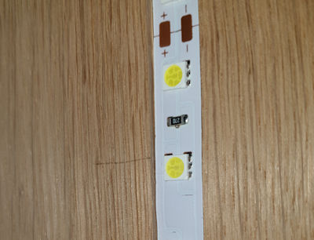
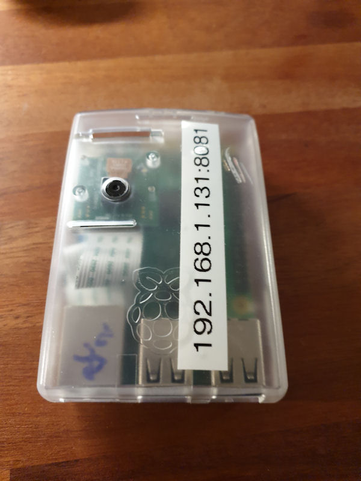
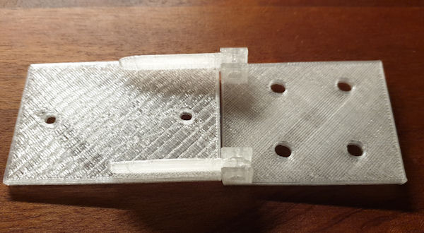
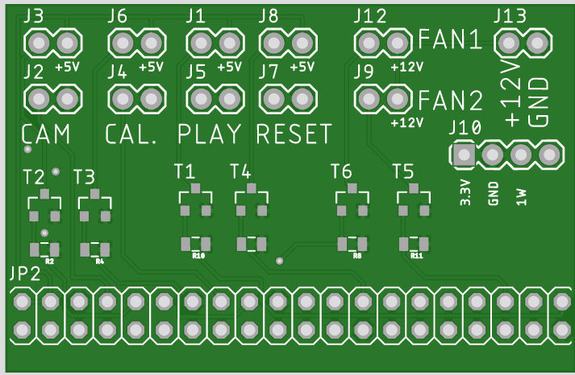
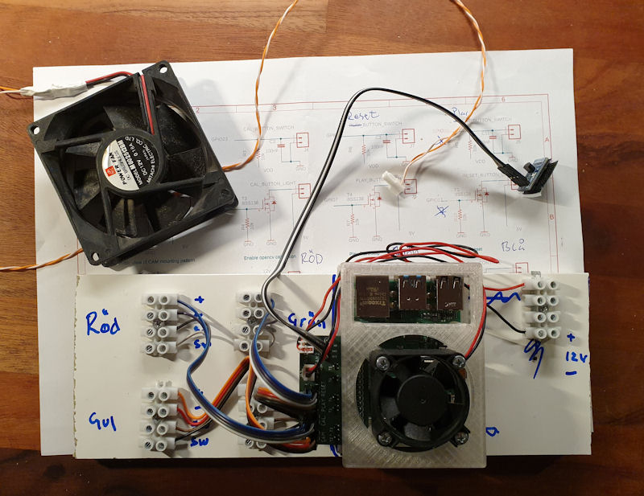

= Dartscore hardware

This readme file describes the DartScore hardware like board, cams, brackets, lightning, moutning details etc etc...

The board:
----------
I use a lightbox for the board to get even lighting conditions.
The 'frame' of the lightox is made of solid oak wood panels (from www.ess-enn.se) cut to the right size and with a
milled 'track'
for the led-tape (standard 12V with 5mm squared leds and c/c  15mm).
The led-strip is located at a distance of 70mm off, from the board-surface
and the inside of the box is 500x500 mm.

Closeup of the mounted led tape.

The Cam(s):
-----------
I use a raspberry pi 3 with a raspicam and the motioneyeos (https://github.com/ccrisan/motioneyeos)  in fast networked cam setup.
Currently one cam is used but the project will be prepared for two in the future.

One of the cameras

The 3d printed camera bracket. Cambracket 1/2.stl are the 3D printer models for this bracket.
I use standard M3 machine-screws to put it together.

In the future there will probably be a complete 3d printable enclosure with bracket for the cams, that fit is purpose
better then the one used today.

The PCB:
--------
In the 'eagle' directory is  a circuit board designed to use with a raspberry pi 4 as the
main computing device in the DartScore project.

The first version of the pcb is like an array of relays, designed with connectors for switches and leds and also for
the control of 2 fans,
one for the CPU and one for the 'box'.  In my project I use 'arcade-switches' from Adafruit and they need 5V as supply for
the builtin leds. Therefore all outputs are 'switched' with mosfets (the 'relays').
The same goes for the fans which are 12V
supplied (I use standard PC fans).

The PCB is available from here: https://aisler.net/p/PMFAHSJW

In the future the PCB will probably be more sofisticated, like one 12V inpout that drives everything including the
Pi itself.

Physical installation:
----------------------

Note that the PCB is mounted with the connectors on the ouside of the Pi-enclosure, otherwise the cooling-fan
shouldn't work. Th sockets to the left are used for connectiong the archade buttons and the socket to the right for
12V from a transformer, supplying the lightbox and the fans

The DartScore station:
----------------------
image:../Docs/20200105_185252.jpg[The station...]

The lightbox with the Adafruit archade switches mounted between the box and the screen.
