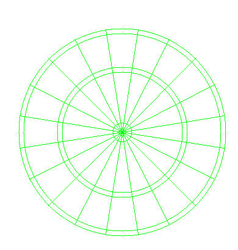

= The calibration pipe line...

### Some tips for the camera settings
To do the calibration the lighting conditions and the camera settings are very important as the
settings for opencv tresholds etc.

Start with lighting for the board. It has to be even and strong enough. I use a led strip
that are mounted on the inside if the dart 'box'. This works very good.

Next is the camera settings. I use a setting where the contrast is high, very little sharpening and
also no auto exposure. By setting the exposure to off/manual and have the same lighting, the
conditions for image detection is better in my opinion (or at least more predictable).

### 1: Find bulls-eye
First find all lines in the picture using HoughLinesP. Aproximate straight lines and
where they cross.  Cut out the board part of the images and move the image to fit the
coordinates of the bulls eye in the perfect board (250, 250).

### 2: Find Sectors
Finding contours of sectors by using filters for area and shape.
Filter out the sector with the largest and smallest area.
These are the one closest to the camera and its opposite, on the other side of the board.

### 3: Match sectors to perfect board geometry

Find 4 points for the sectors that are far from each other and match this to these to the same
points in the perfect board. Create a transform matrix and save it.

The perfect board geometry
--------------------------

Found sectors before the max/min filtering
------------------------------------------
image:cv1.jpg[OpenCv detected sectors]

