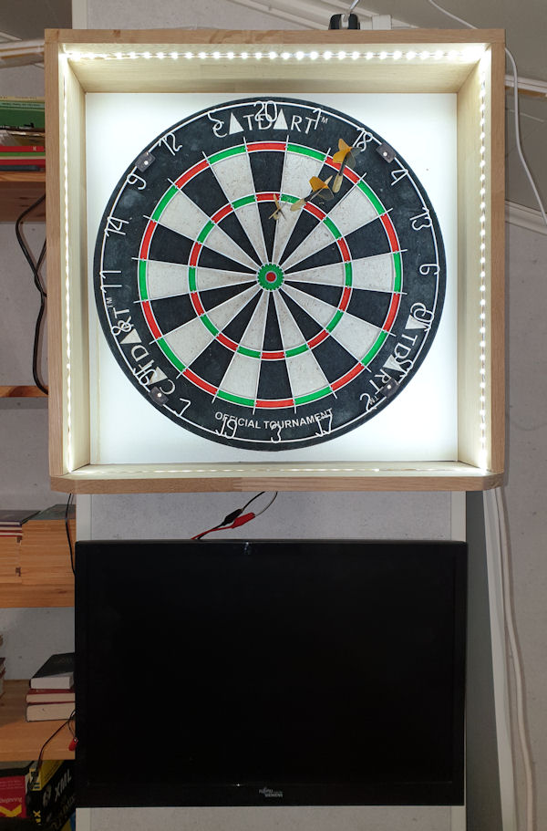

= DartScore, bransch: DartScorePython3

Counting scores for dart with image recognition.

This bransch is forked from DartScoreEngine bransh and will be ported to Python3 but also simplified a lot when it comes to modules and setups.

The project will run one or two fast networked cams as image stream sources, opencv for score-count and PyGame for GUI. This could at least in theory be the same setup except from some file-pathes in all environments.

My environment is a RaspberryPi 4 as the real thing' and Windows 10 for development.
Each module is described in its own readme file (or will be...)

**Prerequisites:**
------------------
Python 3.x, PyGame and OpenCv 3.4.x

Raspberry Pi 4 2GB, Rasbian Buster full (includes Python3 and Python-game)

Install open cv and dependencies:
---------------------------------

- pip3 install opencv-python
- sudo apt-get install libatlas-base-dev
- sudo apt-get install libjasper-dev
- sudo apt-get install libqtgui4
- sudo apt-get install python3-pyqt5
- sudo apt install libqt4-test

