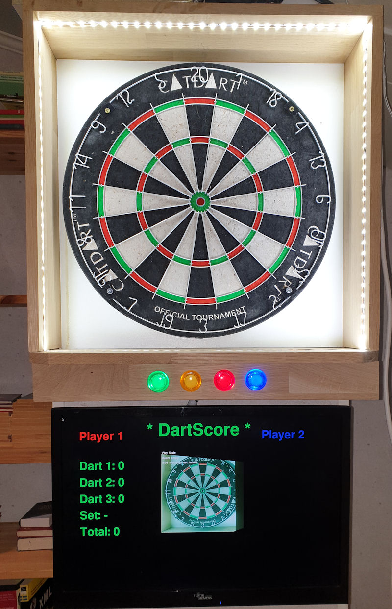
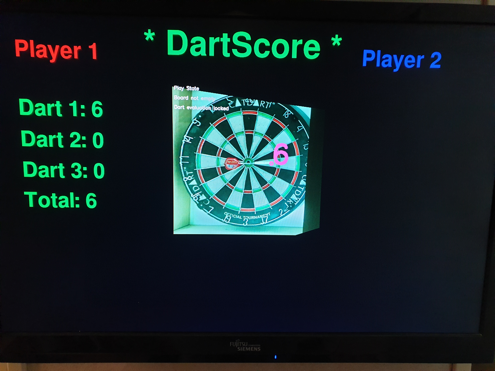

= DartScore, branch: DartScorePython3

== Counting scores in dart with image recognition

This branch is forked from DartScoreEngine branch and it is ported to Python3.
It is also simplified a lot when it comes to modules and setups. This is the current 'master'- branch
and the only DartScore branch currently maintained and I will probably remove the others in the future.

The purpose of this project is to make something that also can be used by others without
too much effort. I put up the information I think is needed for this, but if you miss something, give me a hint and I
will update with that as well.

Currently the project is in 'MVP' (minimum viable product) status wich means that it has a minimum of
functionallity but can be used for real. The supported functionallity is:

* Mounting state to help setting up the cam
* Calibration state to calibrate and transform the image stream from one cam and saving/reading calibration matrix from file
* Playstate supporting one player and a simple algorithm for counting scores for each set of darts but not very accurate
right now.
* All states has a hardcoded gui that is presented on a screen with 1680x1050 resolution

But it works (sort of...) !

== Improvements that will come in future updates (and the current priority):
This is the current plan for this project. The aim is to be able to distribute a project that can be used by others
as soon as possible (the MVP) and then continue with the development of features from there.

* Performace optimisation (main issue right now)
* A better algorithm for counting the scores (main issue right now)
* Support for IO: buttons, leds, temperature-monitor and fans
* Configurable gui (To make it easier for others to use)
* Support for real and configurable gametypes like 301, 501 etc (To be able to use it for real)
* Scoreboard in the cloud (Better incitament for others to use)
* Support for 2 players (To be able to use it for real)
* Support for 2 cams (To further improve the score calculation)
* Saving game stats and be able to continue a game (Nice to have)
* ... more to come...

**Prerequisites:**
------------------
* Python 3.x, PyGame and OpenCv 3.4.x
* Headunit: Raspberry Pi 4 2GB, Rasbian Buster full (includes Python3 and Python-game)
* Network cam, i.e. Raspberry Pi 2 or 3 with a raspicam and motioneyeos configured as a fast networked cam

== Install open cv and dependencies:
These where the packages I had to install to get opencv to work:

- pip3 install opencv-python
- sudo apt-get install libatlas-base-dev
- sudo apt-get install libjasper-dev
- sudo apt-get install libqtgui4
- sudo apt-get install python3-pyqt5
- sudo apt install libqt4-test

== How to use it:

* First you need to install all the prerequisites and have a dartboard available :-)
The dartboard need a good and even lighting, preferable a 'light-box'.
* Next step is to setup the networkdéd camera and install the software. I use a raspberry pi with
a raspi-cam and motioneyeos.
* When the cam is installed and the project is 'cloned' you need to
change the pathes and settings in DartScoreEngineConfig.py to fit your installation,
including the cam-url for the image stream.
* Now its time to mount the camera to have a good view of the dartboard. To help with this, navigate to the
StateLoops directory and run
`sudo python3 CamMountingLoop.py` When done press any key to quit. _*TIP*_: I use the zoom-function in the
fast netcam setup
to be able to have the cam on a distance but still fill the frame with the board as much as possible.
* When the cam is mounted and has a correct view of the dartboard its time to calibrate for the first time. Do
this with `sudo python3 CamCalibrateLoop.py` When done press any key to quit.
* Hopefully the calibration succeeded otherwise you have to change threshold and filter values in the
calibration loop components. This will be more described and configurable in future releases of DartScore.
* When calibrated the first time its possible to just run `sudo python3 Main.py` from the SW directory and the
game starts for real.

(The procedure will be simplified in the future but since I do not have any IO at this point the mount and cal
states needs to be run manually for the first time)

