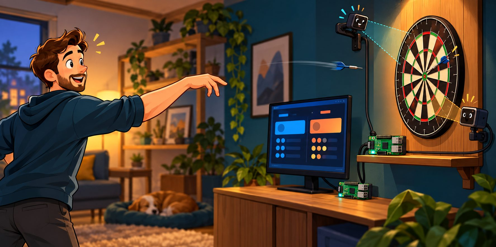

= DartScore

DartScore is an open-source experiment in detecting darts with cameras and turning board hits into game scores. The repository contains a historical Python 3 single-camera MVP and a new, documented direction for a two-Pi system.

== Project status

* *Available now:* the original one-camera Pygame prototype, board calibration/detection code, recorded test videos, an extracted simple-score GameService, a durable camera-free simulator, an HTTP/SSE engine API, and a camera-free web scoreboard/proxy.
* *In design, not implemented yet:* two camera capture on a Raspberry Pi 5, 301/501 rules, Pi service/kiosk deployment, and status LEDs.
* *Accuracy:* the legacy detector is experimental. Replay candidate counts are a reproducible software baseline, not verified scoring accuracy.

The original MVP supports mounting and calibration states, one player, and a simple accumulating score. Its fixed 1680 × 1050 Pygame interface, hardcoded configuration and older camera dependencies have not been migrated to the new hardware. Do not treat the historical instructions as a current Pi 5 installation guide.

== Target architecture

The planned engine runs on a *Raspberry Pi 5 with 8 GB RAM*, two cameras and a 512 GB M.2 SSD. It detects one physical board hit from camera observations. A separate `GameService` applies the chosen game rules, owns game state, and persists accepted events. The engine exposes state, commands and events through a versioned HTTP/JSON API and server-sent events.

A *Raspberry Pi 4B with 2 GB RAM* serves the web UI and drives the screen. All player interaction happens in that browser; game rules and authoritative scores stay with the Pi 5. Both Pis use PoE and wired Ethernet. A display Pi restart should not reset a game.

For the initial web UI, the agreed controls are Start Game, Pause/Resume, and review of uncertain hits: confirm the proposed score, enter a correct single-dart score as points, or reject a false detection. Throws during Pause do not change game state and are not queued for Resume. Evidence images remain on the Pi 5 until manually deleted in the first version. Sector selection, 301/501 rules and automatic image cleanup are later implementation steps.

Read the design documents:

* link:Docs/two-pi-architecture.md[Two-Pi architecture and component migration]
* link:Docs/engine-presentation-api-v1.md[Engine/presentation API contract]
* link:Docs/web-ui-first-release.md[First web UI and uncertain-hit review]

These documents describe the target design; they do not indicate that the new services are running yet.

== Simulate game input without cameras

The board-hit simulator exercises the extracted one-player game, uncertain-hit
review, Pause/Resume, and camera-health states without GPIO, Pygame, or video:

[source,shell]
----
python3 SW/simulate_game.py Testdata/Simulations/basic_game.jsonl
python3 SW/simulate_game.py Testdata/Simulations/basic_game.jsonl --db runtime/game.sqlite3
python3 -m unittest discover -s tests -v
----

Each JSON Lines action produces a game snapshot and result. The example ends
with 80 points after a corrected hit; a throw during Pause is ignored. The
simulator is a developer tool. With `--db`, accepted actions, pending hits and
camera health recover after a process restart. Use a fresh database for a new
simulation scenario. See link:Docs/board-hit-input-and-simulator.md[the input
contract] and link:Docs/durable-game-session.md[the persistence notes].

== Deploy to two Pis for development

For iterative testing across two Pis, use
link:Docs/two-pi-development-deploy.md[the Python SSH/SFTP development deploy guide].
It copies only the current engine code to the Pi 5 and presentation code to the
Pi 4B, keeping game data at its existing path, then restarts those processes.
System services and reboot startup remain later work.

== Run the camera-free engine API

From the repository root, run `python3 SW/serve_engine.py --db runtime/game.sqlite3`.
It listens on loopback port 8765. State, health, commands and an SSE stream
are available for the existing `simple_score` game. Add `--dev-input` to
simulate board hits through a loopback-only development route. See
link:Docs/engine-presentation-api-v1.md[the API contract and current scope].
Run `python3 SW/serve_presentation.py` in another terminal and open
`http://127.0.0.1:8080`. On the Pi 4B, set `--engine-url` to the Pi 5's
trusted-LAN address and use `--host 0.0.0.0` to serve its screen/browser.
See link:Docs/web-ui-first-release.md[web UI scope and setup]. The page
supports one-player simple score, Start, Pause/Resume, and pending-hit review;
it does not yet display stored evidence images.

== Replay the legacy detector

The headless replay runs on a development computer without a camera, GPIO or Pygame. From the repository root, using Python 3.10 or later:

[source,shell]
----
python3 -m venv .venv
.venv/bin/python -m pip install -r requirements-replay.txt
.venv/bin/python SW/replay_video.py Testdata/Videos/dartscore_20191107_152701.avi --output replay-report.json
----

The JSON report contains frame numbers, timestamps, candidate points and legacy scores. The first bundled video produced 238 frames and 9 candidates in the documented baseline run. Those scores are not ground truth: replay assumes the first frame is an empty board and does not automatically calibrate the video. See link:Docs/video-replay-baseline.md[the replay notes] for the second video, options and limitations.

== Development path

. Label recorded throws and verify board-hit/scoring behavior.
. Separate game rules and state from detection and Pygame while preserving the replay path.
. Implement the engine API, persistence and web scoreboard.
. Add Pi 5 hardware status, two-camera capture and independent calibration.
. Validate 301/501 rules and detection accuracy before treating scores as reliable.

Historical prototype setup instructions are retained in link:Docs/legacy-single-camera-setup.adoc[Legacy single-camera setup (2020)]. The current code layout is described in link:SW/readme.adoc[the software notes].

Licensed under link:LICENSE[GNU GPLv3].
